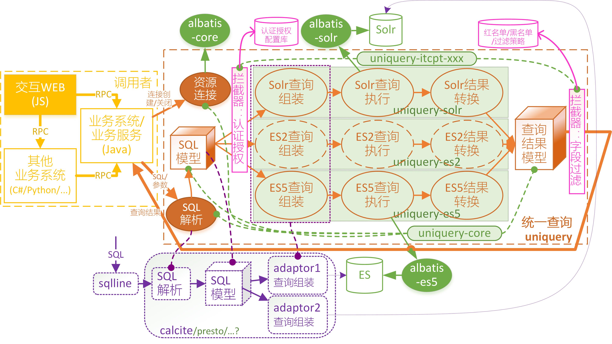

# 统一查询

## 开发规范

### 定义

- group: com.hzcominfo.dataggr.uniquery
- artifact: uniquery
- version: 0.0.1-SNAPSHOT

#### 部件

- uniquery-core：核心依赖包，提供对外接口、SQL解析
- 适配器模块：
	- uniquery-adaptor-solr：Solr查询组装、查询执行、结果组装
	- uniquery-adaptor-es5：ElasticSearch5查询组装、查询执行、结果组装
	- uniquery-adaptor-es2：ElasticSearch5查询组装、查询执行、结果组装
- 拦截器模块：
	- uniquery-itcpt-auth：认证授权
	- uniquery-itcpt-field-mask：字段值黑名单/红名单脱敏

#### 代码

##### 代码管理

首个版本开发阶段，使用dataggr仓库组、dataggr仓库，lib-uniquery目录。

开发完成首个测试，发布RC版本，切换到独立仓库，作为独立框架组件。

##### 项目结构

- lib-uniquery/pom.xml
- lib-uniquery/core/pom.xml: uniquery-core
- lib-uniquery/solr/pom.xml: uniquery-solr
- lib-uniquery/es2/pom.xml: uniquery-es2
- lib-uniquery/es5/pom.xml: uniquery-es5
- lib-uniquery/auth/pom.xml: uniquery-auth
- lib-uniquery/field-mask/pom.xml: uniquery-field-mask
- lib-uniquery/mongo/pom.xml: uniquery-mongo

### 构建

统一使用maven构建。
产品应继承com.hzcominfo:parent:3.0.0-SNAHSHOT父pom。
构建结果发布匡信产品仓库，使用定义的GAV结构。

## 总体设计

统一搜索作为大数据业务处理平台核心框架，主要为业务系统提供统一的数据操作接口。应**逐步**支持以下功能：
1. 数据连接资源管理
2. 数据操作接口（DML）
	1. 查询操作：select
		2. 单表查询
			3. 元功能：where、as、count、distinct、group by、order by、limit、skip
			11. 函数：*（暂无）*
				12. 数学函数（sum/avg/max/min等）
				13. 字符串函数（substr、concat等）
				14. 类型转换函数（cast、日期时间parse/format等）
		3. 多表关联查询*（暂无）*
			4. join
			5. union
			6. 子查询
	2. 插入操作：insert*（暂无）*
	3. 修改操作：update/upsert*（暂无）*
	4. 删除：delete*（暂无）*
4. 数据定义接口（DDL）*（暂无）*
	5. 创建：create table/database
	6. 调整：alter table/database
	7. 删除：drop table/database

## 接口定义

### 资源管理

1. 资源创建：根据调用者提供的资源描述（数据库连接串/URISpec），创建数据库连接，返回统一的资源连接标识（对象/ID）
2. 资源管理：提供类似连接池配置，对于相同的数据库连接申请，重用已经创建的连接。
3. 资源释放：根据提供的资源连接标识关闭并清理指定数据库连接资源。

### 单表查询

根据连接标识，提供数据查询接口。

- 输入参数
	1. 连接标识
	2. SQL语句
	3. 参数（可选）
		4. 列表参数
		5. 名字参数*（暂无）*
- 返回结果：根据不同查询语句和调用方式，返回相应结果类型
	- 单个值（如count）
	- 单个Map&lt;String, Object&gt;对象
	- List&lt;Map&lt;String, Object&gt;&gt;

## 技术架构

